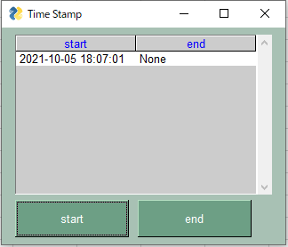
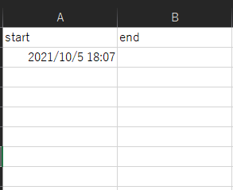
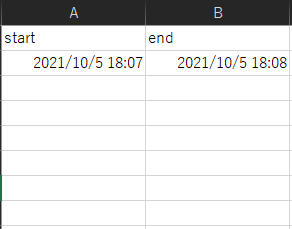

## 概要
時間をDiscordとExcelの両方に保存できるタイムスタンプです。

## 使い方
exeファイル内の.env.exampleを.envにrenameします。

ファイルにDiscordの投稿したいチャンネルのWebHookURLを保存します。

main.exeファイルを開き、startを押すとDiscordに開始時間が投稿され、同時にExcel
のTimeSheetに開始時間が記録されます。

Fig.1 Window_Start

Fig.2 Excel_Start

Fig.3 Discord_Start

endを押すとDiscordに終了時間が投稿され、同時にexcel
のTimeSheetに終了時間が記録されます。

Fig.4 Window_End

Fig.5 Excel_End

Fig.6 Discord_End

※　Excelは記録と同時に保存されます。
※　exeファイルを閉じるとExcelも自動に閉じます。
※　Recordファイルを開いて、直接時間を編集することも可能です。